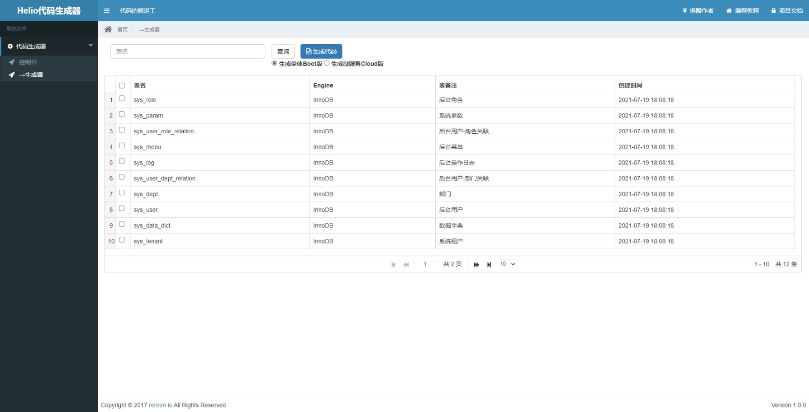

# helio-generator

## 项目说明
基于 [renren-generator](https://gitee.com/renrenio/renren-generator) 改造适配的代码生成器，可一键生成单体or微服务版的前、后端代码，减少无谓的重复劳动

## 它能做什么？
1. 生成后端 Java 代码
   1. 后台管理 Controller 层 REST 接口、分页列表查询DTO（及对应 swagger 注解）、新增/编辑DTO（及对应 swagger、validation 注解）、菜单 SQL
   2. CRUD 需要的 Entity 、Mapper、Service(及分页列表条件筛选构造器) 三层结构代码
   3. 返回体 BO
   4. 单元测试
   5. 【微服务版专有】 Facade 接口及对应的 FacadeImpl
2. 生成前端 Vue3 代码（皆为 TypeScript ）
   1. 自动指向后台管理 REST API
   2. 新增/编辑请求体、通用响应体
   3. 分页列表页、查看详情表单、新增/编辑表单等
   
## 如何使用

1. 从 GitHub 或 Gitee 克隆项目源码，到自己的电脑上
2. 找到`resources/application.yml`，修改里面的数据库`数据库类型、连接地址、账号、密码`等
3. 找到`resources/generator.properties`，修改里面的`包名、模块名、作者`等
4. 找到`src/main/java/io/renren/GeneratorApplication.java`，运行项目
5. 浏览器访问 http://127.0.0.1:6688 ，就能看到代码生成器页面了

## License
[GPL-3.0](./LICENSE)

## 演示效果图

