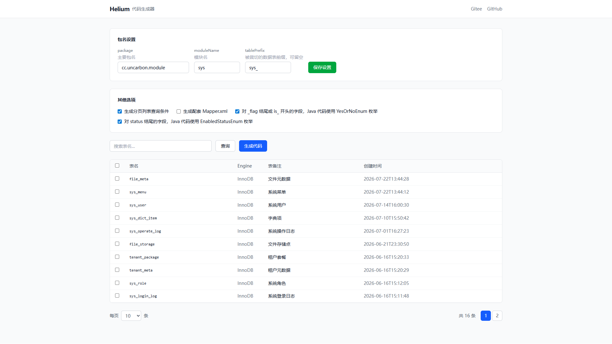

# helium-codegen

## 项目说明
基于 [renren-generator](https://gitee.com/renrenio/renren-generator) 二次开发，适配 helium 开发脚手架

【[更新记录](https://helium.uncarbon.cc/appendix/change-log)】

## 它能做什么？
1. 生成后端 Java 代码
   1. 后台管理 Controller、查询/增改入参模型、出参模型、新菜单 SQL
   2. DAL、Service 模板代码
2. 生成后台管理前端 Vue3 代码
   1. API 契约
   2. 列表页、详情页、新增/编辑页等

## 如何使用

1. 克隆项目源码，到自己的电脑上
2. 找到`resources/application-datasource.yml`，修改里面的数据库数据源
3. 找到`CodegenApplication`启动类，运行项目
4. 浏览器访问 http://127.0.0.1:6688 ，就能看到代码生成器页面了

## License
[GPL-3.0](./LICENSE)

## UI 截图

