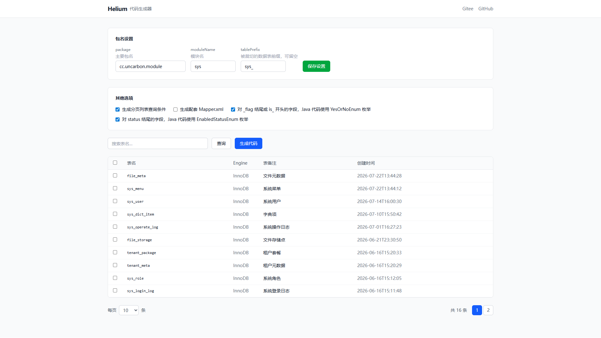

# helium-codegen

## 项目说明
基于 [renren-generator](https://gitee.com/renrenio/renren-generator) 二次开发，适配 helium 开发脚手架

【[更新记录](https://helium.uncarbon.cc/#/change-log)】

## 它能做什么？
1. 生成后端 Java 代码（以 helium-monolith 系统管理模块的角色管理为蓝本，仅生成 CRUD 部分）
   1. 后台管理 Controller：分页查询、详情、新增、修改、删除
   2. 查询/增改入参模型、出参 DTO 模型
   3. DAL：Entity、Mapper，可选配套 Mapper.xml
   4. Service 接口与实现
   5. 新菜单 DDL SQL
2. 生成后台管理前端 Vue3 代码（适配`helium-admin-ui`）
   1. API 契约：查询条件、新增/修改表单、值对象 TS 类型 + 分页/详情/新增/修改/删除接口
   2. 列表页：查询表单 + 表格 + 操作列
   3. 表格列/表单定义
   4. 新增/编辑抽屉
   5. 生成后需手动在 `api/<模块名>/index.ts` 中补一行 `export * from './<kebab类名>';`

## 如何使用

1. 克隆项目源码，到自己的电脑上
2. 找到`resources/application-datasource.yml`，修改里面的数据库数据源
3. 找到`CodegenApplication`启动类，运行项目
4. 浏览器访问 http://127.0.0.1:6688 ，就能看到代码生成器页面了

## License
[GPL-3.0](./LICENSE)

## UI 截图

